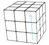

# Rubikscube

Méthode de résolution presque simple du Rubik's cude.

## 1/ Faire la croix

## 2/ Positionner les arrêtes de la croix

### 2a/ Deux arrêtes opposées de bien plaçées

A [         ]

### 2b/ Deux arrêtes adjacentes de bien plaçées

Faire comme en 2A, puis refaire la séquence A

## 3/ Amener les coins 

